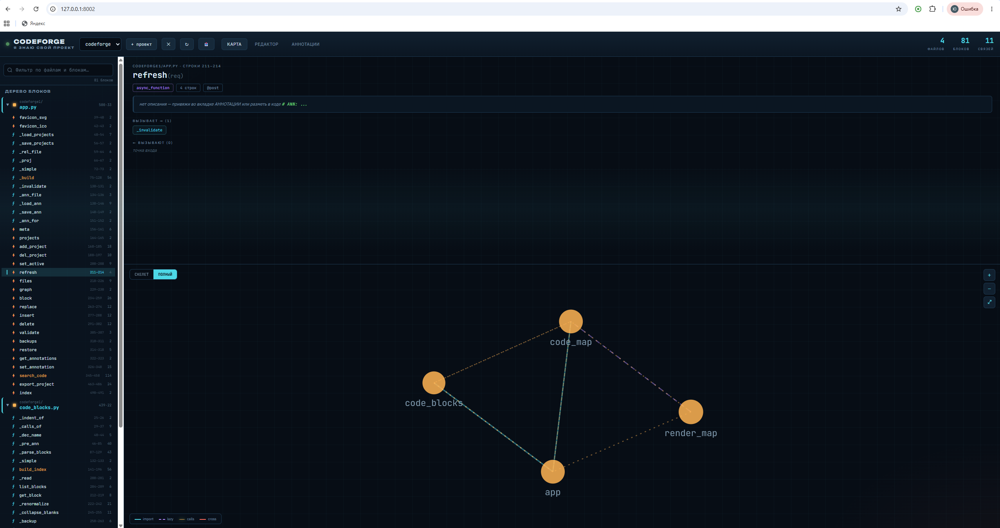

# CodeForge — я знаю свой проект

> Визуальный навигатор по Python-проектам для вайбкодеров. Карта, редактор блоков, граф вызовов, аннотации — всё в одном окне браузера.




## Что это

CodeForge парсит ваш Python-проект через AST, строит карту файлов / функций / классов и рисует интерактивный граф связей. Можно:

- **Смотреть** — дерево блоков, граф импортов и вызовов, статистика
- **Искать** — по именам блоков, docstring, `# ANN:`-комментариям и коду
- **Править** — заменять, вставлять, удалять блоки целиком с AST-валидацией и бэкапами
- **Аннотировать** — привязывать описания «за что отвечает» к блокам (уходят в промпт LLM вместе с графом)

## Быстрый старт

```bash
# 1. Клонируй
git clone https://github.com/USERNAME/codeforge.git
cd codeforge

# 2. Зависимости
pip install -r requirements.txt

# 3. Запуск
python app.py
# → http://127.0.0.1:8002

# 4. В браузере: нажми «+ проект», укажи путь к папке с кодом
```

## Структура

```
codeforge/
├── app.py              # FastAPI-сервер + реестр проектов + API
├── code_map.py         # AST-парсер → дерево блоков + граф связей
├── code_blocks.py      # Атомарные правки блоков (AST-safe, с бэкапами)
├── index.html          # SPA-интерфейс (карта / редактор / аннотации / поиск)
├── render_map.py       # CLI: экспорт карты в статический HTML
└── data/               # Аннотации и бэкапы (создаются автоматически)
```

## Ключевые фичи

### `# ANN:` — аннотации прямо в коде
```python
# ANN: Парсит файлы проекта, строит дерево блоков и граф связей
def build_project_map(project_dir: Path) -> dict:
    ...
```
Комментарий `# ANN:` над блоком автоматически подхватывается в карту и уходит в экспорт.

### Режимы графа
- **СКЕЛЕТ** — только файлы-хабы (>300 строк или >4 связей). Большой проект читается.
- **ПОЛНЫЙ** — все узлы. Для небольших проектов.

### Горячие клавиши
| Клавиша | Действие |
|---------|----------|
| `Ctrl + Shift + F` | Глобальный поиск по коду |
| `Ctrl + F` | Поиск по дереву блоков |
| `Ctrl + S` | Применить изменения в редакторе |
| `Esc` | Закрыть модалки / сбросить фильтр |

### AST-Guard
Любая правка (replace / insert / delete) проверяется на синтаксис ДЕС записи. Не сошлось — файл не тронут, бэкап сохранён.

## CLI

```bash
# Карта проекта в терминал
python code_map.py list ./my_project

# Статический HTML с картой
python render_map.py ./my_project
# → project_map.html

# Правка блоков из командной строки
python code_blocks.py get    myfile.py my_func
python code_blocks.py replace myfile.py my_func --from new.py
python code_blocks.py delete  myfile.py old_func
```

## Лицензия

MIT
